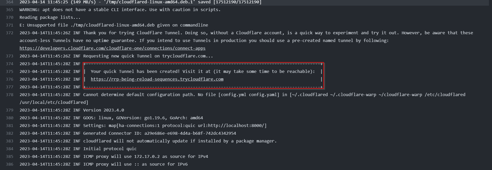

# Expose container to public URL
Do you need to test a web app with a valid HTTPS certificate but don't want to go through the hassle of obtaining one? Look no further! This project demonstrates how you can easily use Cloudflare tunnels to expose any web app for testing purposes with a valid HTTPS certificate.

## Usecase

With Cloudflare tunnel, you can expose your web app (from anywhere with a internet connection) to the public internet with a valid HTTPS certificate in just a few easy steps.


## HowTo
Build container image
```bash
podman build -f ./Dockerfile -t expose_me:latest
```

Run the container
```bash
podman run -it expose_me:latest
```

The address of the tunnel is visible on the CLI output as well as appended to the `index.html` accessable on port 8000 of the container.



## Official Documentation
Official documentation for this project can be found at:
- https://developers.cloudflare.com/cloudflare-one/connections/connect-apps/
- https://developers.cloudflare.com/pages/how-to/preview-with-cloudflare-tunnel/

## Credits
This project was created by @njannasch
